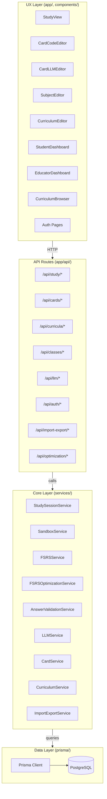
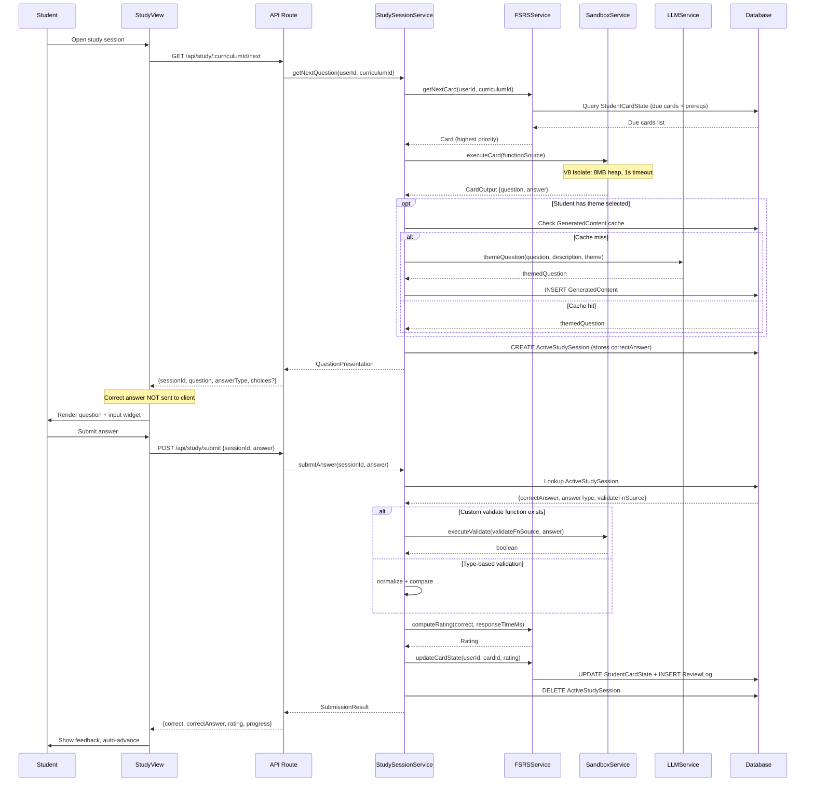
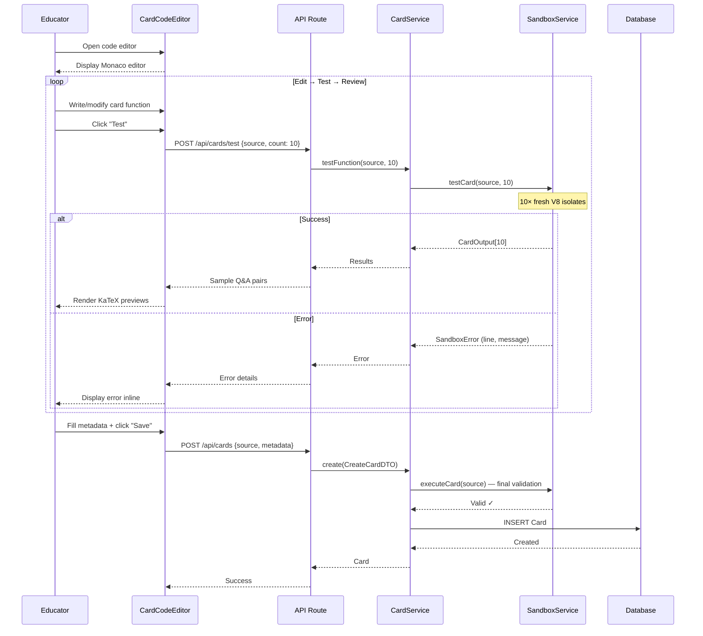
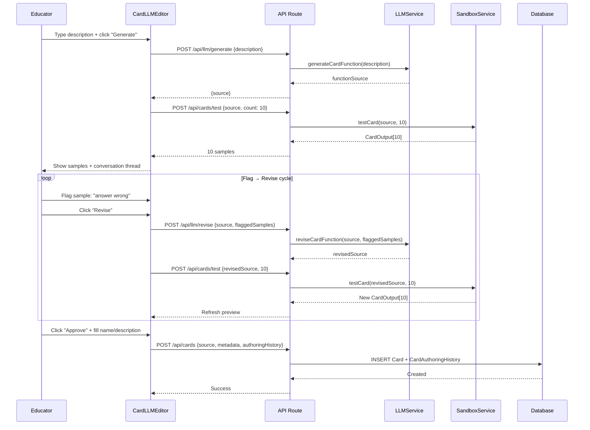

# Programmable Spaced Repetition Learning Platform

## Low-Level Design Report

Senior Design Project · February 2026

---

## Table of Contents

1. [Introduction](#1-introduction)
2. [Architecture Overview](#2-architecture-overview)
3. [Data Model](#3-data-model)
4. [Service Interfaces (Core Layer)](#4-service-interfaces-core-layer)
5. [API Route Interfaces](#5-api-route-interfaces)
6. [UX Layer: Components and Pages](#6-ux-layer-components-and-pages)
7. [Data Flows](#7-data-flows)
8. [Error Handling and Edge Cases](#8-error-handling-and-edge-cases)
9. [Testability](#9-testability)
10. [References](#10-references)

---

## 1. Introduction

This report describes the low-level architecture and class-level design of the programmable spaced repetition learning platform. It translates the Platform Design Report's architectural decisions into typed data models, service interfaces, API route contracts, and React component specifications. The LLD eliminates technical ambiguity before implementation begins.

### 1.1 Object Design Trade-offs

#### 1.1.1 Security vs. Flexibility

Card scripts execute in sandboxed V8 isolates with hard memory and CPU limits. This sacrifices the flexibility of arbitrary Node.js code (no `require`, no `fs`, no network) in exchange for a security model where untrusted code cannot affect the host. Acceptable because card functions need only basic JavaScript: arithmetic, `Math.random()`, string formatting, and conditionals.

#### 1.1.2 Simplicity vs. Granularity

Difficulty progression is structural (card ordering within subjects, subject prerequisites within curricula) rather than parametric (a step parameter). This sacrifices single-card difficulty scaling for independently testable cards. Difficulty is a property of *which* card the student studies, not *how* the card generates.

#### 1.1.3 Consistency vs. Richness

Questions render as Markdown + KaTeX rather than arbitrary HTML. This sacrifices custom question presentations for visual consistency across all cards and a single rendering code path.

#### 1.1.4 Correctness vs. Speed

Correct answers never leave the server. Validation is always server-side, adding a round-trip to every submission but preventing answer interception via browser developer tools.

### 1.2 Interface Documentation Guidelines

Types and interfaces use PascalCase. Functions and variables use camelCase. Database fields use camelCase in Prisma (mapped to snake_case in PostgreSQL). API routes follow Next.js App Router: `/api/[resource]/[id]/[action]`. Class interfaces are described with typed attributes and method signatures.

### 1.3 Engineering Standards

This report uses UML conventions for class structures and sequence descriptions. TypeScript interfaces serve as formal specifications. The Prisma schema is the single source of truth for the database model. API routes are documented with HTTP method, path, request body, and response types.

### 1.4 Definitions, Acronyms, and Abbreviations

| Term | Definition |
|------|-----------|
| FSRS | Free Spaced Repetition Scheduler |
| KaTeX | Fast LaTeX math rendering library |
| V8 Isolate | Separate V8 JS engine instance with own heap |
| isolated-vm | Node.js package for V8 isolate sandboxing |
| Prisma | Type-safe ORM for Node.js/TypeScript |
| NextAuth | Authentication library for Next.js |
| ts-fsrs | Official TypeScript FSRS implementation |
| Monaco | VS Code's editor engine |
| DAG | Directed Acyclic Graph |
| SSO | Single Sign-On (OIDC/SAML) |
| TOTP | Time-based One-Time Password (2FA) |
| WebAuthn | Web Authentication API for passkeys |

---

## 2. Architecture Overview

### 2.1 Instance Modes

The platform supports three deployment modes via environment variable:

```bash
INSTANCE_MODE=community|publisher|school
```

| Mode | Who creates? | Who studies? | Access model | Classes? |
|------|--------------|--------------|--------------|----------|
| Community | Everyone | Everyone | Open browse | No |
| Publisher | Educators only | Everyone | Open browse | No |
| School | Educators only | Assigned students | Restricted | Yes |

Registration is orthogonal:

```bash
REGISTRATION=open|domain|sso|invite|code
```

Visibility is mode-determined, not per-curriculum. Community/Publisher modes allow open browsing; School mode restricts to class assignments.

### 2.2 Layered Architecture

The platform is two layers within a single Next.js application:

**Core Layer (lib/, services/):** Pure business logic. Prisma schema, service modules (sandbox, FSRS, validation, LLM, import/export), typed interfaces. No React dependency. Testable via automated tests or API calls.

**UX Layer (app/, components/):** React components consuming the Core Layer via API routes and server actions. All pages, editors, and dashboards. Zero business logic. Removable without breaking the API.

### 2.3 Directory Structure

```
/
├─ prisma/schema.prisma        # Data model
├─ lib/types/                   # Shared TS interfaces and enums
├─ lib/prisma.ts                # Prisma client singleton
├─ services/
│  ├─ sandbox.service.ts        # V8 isolate execution
│  ├─ fsrs.service.ts           # FSRS scheduling and rating
│  ├─ optimization.service.ts   # Parameter optimization
│  ├─ validation.service.ts     # Answer validation
│  ├─ llm.service.ts            # Authoring + theming
│  ├─ import-export.service.ts
│  ├─ study.service.ts          # Study session orchestration
│  ├─ card.service.ts           # Card CRUD
│  └─ curriculum.service.ts     # Curriculum/subject management
├─ app/api/                     # API route handlers
├─ app/(auth)/                  # Auth pages
├─ app/study/                   # Study session
├─ app/editor/                  # Card authoring
├─ app/curricula/               # Browser + editor
├─ app/dashboard/               # Student + educator
└─ components/                  # Shared React components
```

### 2.4 Package Diagram



**Package summary:**

- **Model (prisma/, lib/types/):** Data types, database schema, enums, DTOs.
- **Services (services/):** Stateless business logic modules. One responsibility per service.
- **API Routes (app/api/):** HTTP interface. Validates input, delegates to services, returns typed responses.
- **UX (app/, components/):** React pages and components. Consumes API routes. No direct DB access.

### 2.5 Behavioral Decisions

#### Prerequisite Enforcement
Mode defaults: school=hard, community/publisher=soft. Optional override via `PREREQ_ENFORCEMENT=hard|soft|none`.

#### Subject Mastery
A subject is mastered when all its cards reach Review state. Dependent subjects then unlock.

#### Curriculum Updates
Curricula are live - updates apply to enrolled students. New content respects dependencies. If student has already mastered a subject, new prerequisites below it are grandfathered.

#### Progress Reset
Community/Publisher: User can reset own progress. School: Educator resets student progress.

#### Content Deletion
Soft delete - cards/subjects marked deleted, progress preserved for analytics.

#### Study Session
- Binary rating (Pass/Fail)
- Session-scoped undo history
- No daily limits on new/review cards
- FSRS priority for card ordering
- No early review (scheduling respected)

---

## 3. Data Model

Each model maps to a PostgreSQL table. TypeScript types are auto-generated by Prisma.

### 3.1 Entity-Relationship Overview

- **User group:** User (with role) → StudentCardState[], ReviewLog[], ClassEnrollment[], UserCurriculumEnrollment[].
- **Content group:** Card → CardSubject (with position) → Subject → CurriculumSubject → Curriculum. Subjects linked by SubjectPrerequisite forming a DAG.
- **Study group:** StudentCardState (per user-card) with FSRS state. ReviewLog (per review event). ActiveStudySession (server-side answer storage).
- **Organization group:** Class → ClassEnrollment (students), CurriculumAssignment, CardStepOverride.
- **LLM group:** CardAuthoringHistory (LLM provenance). GeneratedContent (themed question cache). Theme (theming profiles).

### 3.2 Class Diagram — Data Model

```mermaid
classDiagram
    direction TB

    class User {
        +String id
        +String name
        +String email
        +String passwordHash?
        +Role role
        +String selectedThemeId?
        +Boolean twoFactorEnabled
        +Json fsrsParameters?
        +DateTime createdAt
    }

    class Card {
        +String id
        +String functionSource
        +String description
        +String name
        +AnswerType answerType
        +Int learningSteps
        +Int relearningSteps
        +String[] tags
        +String authorId
    }

    class CardAuthoringHistory {
        +String id
        +String cardId
        +Json entries
        +DateTime updatedAt
    }

    class Subject {
        +String id
        +String name
        +String description?
        +String authorId
    }

    class CardSubject {
        +String cardId
        +String subjectId
        +Int position
    }

    class Curriculum {
        +String id
        +String name
        +String authorId
    }

    class CurriculumSubject {
        +String curriculumId
        +String subjectId
    }

    class SubjectPrerequisite {
        +String subjectId
        +String prerequisiteId
    }

    class StudentCardState {
        +String id
        +String userId
        +String cardId
        +CardState state
        +Float stability
        +Float difficulty
        +Int reps
        +Int lapses
        +Int stepIndex
        +DateTime due
    }

    class ReviewLog {
        +String id
        +String userId
        +String cardId
        +Rating rating
        +Boolean correct
        +Int responseTimeMs
    }

    class ActiveStudySession {
        +String id
        +String userId
        +String cardId
        +String correctAnswer
        +AnswerType answerType
        +String validateFnSource?
        +DateTime expiresAt
    }

    class Theme {
        +String id
        +String name
        +String promptTemplate
    }

    class GeneratedContent {
        +String id
        +String cardId
        +String themeId
        +String originalQuestion
        +String themedQuestion
    }

    class Class {
        +String id
        +String name
        +String educatorId
    }

    class ClassEnrollment {
        +String userId
        +String classId
    }

    class CurriculumAssignment {
        +String classId
        +String curriculumId
    }

    class UserCurriculumEnrollment {
        +String userId
        +String curriculumId
    }

    class CardStepOverride {
        +String classId
        +String cardId
        +Int learningSteps?
        +Int relearningSteps?
    }

    User "1" --> "*" StudentCardState : studies
    User "1" --> "*" ReviewLog : logs
    User "1" --> "*" Card : authors
    User "1" --> "*" ClassEnrollment : enrolls in
    User "1" --> "*" Class : teaches
    User "*" --> "0..1" Theme : selects

    Card "1" --> "*" CardSubject : appears in
    Card "1" --> "0..1" CardAuthoringHistory : has history
    Card "1" --> "*" StudentCardState : tracked by
    Card "1" --> "*" ReviewLog : reviewed in
    Card "1" --> "*" GeneratedContent : themed as
    Card "1" --> "*" CardStepOverride : overridden by

    Subject "1" --> "*" CardSubject : contains
    Subject "1" --> "*" CurriculumSubject : part of
    Subject "1" --> "*" SubjectPrerequisite : prerequisite of

    Curriculum "1" --> "*" CurriculumSubject : includes
    Curriculum "1" --> "*" CurriculumAssignment : assigned to
    Curriculum "1" --> "*" UserCurriculumEnrollment : enrolled by

    Class "1" --> "*" ClassEnrollment : has students
    Class "1" --> "*" CurriculumAssignment : has curricula
    Class "1" --> "*" CardStepOverride : has overrides

    Theme "1" --> "*" GeneratedContent : produces
```



### 3.3 User and Authentication

#### `User`

All platform users. Auth data stored by NextAuth (Account, Session). User stores application-level data.

| Type | Attribute | Description |
|------|-----------|-------------|
| `String` | `id` | UUID, cuid() |
| `String` | `name` | Display name |
| `String` | `email` | Unique email |
| `String?` | `passwordHash` | bcrypt hash. Null for SSO users |
| `Role` | `role` | ADMIN \| EDUCATOR \| STUDENT |
| `String?` | `selectedThemeId` | FK to Theme |
| `Boolean` | `twoFactorEnabled` | TOTP 2FA active |
| `String?` | `twoFactorSecret` | Encrypted TOTP secret |
| `Json?` | `fsrsParameters` | Per-student optimized FSRS params (null = use global) |
| `DateTime` | `createdAt` | |
| `DateTime` | `updatedAt` | |

**Relations:** studentCardStates[], reviewLogs[], enrollments[], curriculumEnrollments[], classesAsEducator[], authoredCards[]

### 3.4 Content Models

#### `Card`

A JavaScript function producing question-answer pairs. Stores source, metadata, and authoring context.

| Type | Attribute | Description |
|------|-----------|-------------|
| `String` | `id` | UUID |
| `String` | `functionSource` | JS source code |
| `String` | `description` | Required. What this card tests |
| `String` | `name` | Display name |
| `AnswerType` | `answerType` | INTEGER \| DECIMAL \| TEXT \| FRACTION \| CHOICE |
| `Int` | `learningSteps` | Successful reviews to graduate (default: 5) |
| `Int` | `relearningSteps` | Successes to re-graduate lapsed card (default: 3) |
| `String[]` | `tags` | Searchable tags |
| `String` | `authorId` | FK to User |
| `DateTime` | `createdAt` | |
| `DateTime` | `updatedAt` | |

**Relations:** author, cardSubjects[], authoringHistory?, studentCardStates[], reviewLogs[], generatedContents[], stepOverrides[]

#### `CardAuthoringHistory`

LLM authoring provenance. Null for code-editor cards.

| Type | Attribute | Description |
|------|-----------|-------------|
| `String` | `id` | UUID |
| `String` | `cardId` | FK to Card (unique 1:1) |
| `Json` | `entries` | Array of `{ type, content, timestamp, sampleIndex? }` |
| `DateTime` | `updatedAt` | |

Entry types: `prompt` (educator's description), `generation` (LLM's function), `flag` (flagged sample), `correction` (educator's fix), `approval` (final save).

### 3.5 Curriculum Structure

#### `Subject`

Topic area containing ordered cards. Subjects are global and can be reused across curricula. Subjects form a global DAG via SubjectPrerequisite.

| Type | Attribute | Description |
|------|-----------|-------------|
| `String` | `id` | UUID |
| `String` | `name` | e.g., "Two-Digit Addition" |
| `String?` | `description` | |
| `String` | `authorId` | FK to User (who created this subject) |

**Relations:** author, cards[] (via CardSubject), curriculumSubjects[], prerequisiteOf[], prerequisites[]

#### `CardSubject`

Join: Card ↔ Subject with position.

| Type | Attribute | Description |
|------|-----------|-------------|
| `String` | `cardId` | FK to Card |
| `String` | `subjectId` | FK to Subject |
| `Int` | `position` | Order in subject (0-indexed) |

#### `Curriculum`

DAG of subjects. Complete learning path.

| Type | Attribute | Description |
|------|-----------|-------------|
| `String` | `id` | UUID |
| `String` | `name` | e.g., "Grade 3 Mathematics" |
| `String?` | `description` | |
| `String` | `authorId` | FK to User |

**Note:** Visibility is determined by instance mode, not per-curriculum flag. See Instance Modes section.

**Relations:** author, subjects[] (via CurriculumSubject), assignments[], individualEnrollments[]

#### `CurriculumSubject`

Join: Curriculum ↔ Subject.

#### `SubjectPrerequisite`

Directed edge in the DAG. Subject cannot start until prerequisite is mastered.

| Type | Attribute | Description |
|------|-----------|-------------|
| `String` | `subjectId` | Dependent subject |
| `String` | `prerequisiteId` | Must be mastered first |

### 3.6 Study and Scheduling

#### `StudentCardState`

One student's FSRS state for one card. Central study engine table. **Unique on (userId, cardId).**

| Type | Attribute | Description |
|------|-----------|-------------|
| `String` | `id` | UUID |
| `String` | `userId` | FK to User |
| `String` | `cardId` | FK to Card |
| `CardState` | `state` | NEW \| LEARNING \| REVIEW \| RELEARNING |
| `Float` | `stability` | FSRS stability |
| `Float` | `difficulty` | FSRS difficulty (1.0–10.0) |
| `Int` | `elapsedDays` | Days since last review |
| `Int` | `scheduledDays` | Days until next review |
| `Int` | `reps` | Total reviews |
| `Int` | `lapses` | Times forgotten |
| `Int` | `stepIndex` | Position in learning/relearning steps |
| `DateTime` | `due` | Next review time |
| `DateTime?` | `lastReview` | |

#### `ReviewLog`

Immutable log of every review. Used for analytics and future algorithm improvements.

| Type | Attribute | Description |
|------|-----------|-------------|
| `String` | `id` | UUID |
| `String` | `userId` | FK |
| `String` | `cardId` | FK |
| `Rating` | `rating` | PASS \| FAIL |
| `Boolean` | `correct` | |
| `Int` | `responseTimeMs` | Question display to answer submission |
| `AnswerMedium` | `answerMedium` | MENTAL, TYPING, PEN_PAPER, OTHER |
| `String` | `generatedQuestion` | The actual question shown |
| `String` | `generatedAnswer` | The correct answer for this instance |
| `CardState` | `stateBeforeReview` | |
| `Float` | `stabilityBefore` | |
| `Float` | `difficultyBefore` | |
| `DateTime` | `createdAt` | |

#### `ActiveStudySession`

Server-side record of in-progress question. Stores correct answer so it never reaches the client.

| Type | Attribute | Description |
|------|-----------|-------------|
| `String` | `id` | UUID (session instance token) |
| `String` | `userId` | FK |
| `String` | `cardId` | FK |
| `String` | `correctAnswer` | Correct answer for this instance |
| `AnswerType` | `answerType` | |
| `String?` | `validateFnSource` | Custom validate function, if card provides one |
| `DateTime` | `presentedAt` | When question was shown |
| `DateTime` | `expiresAt` | TTL for cleanup (default: +10 min) |

### 3.7 LLM and Theming

#### `Theme`

Theming profile for study-time question rewording.

| Type | Attribute | Description |
|------|-----------|-------------|
| `String` | `id` | UUID |
| `String` | `name` | e.g., "Space", "Fantasy" |
| `String` | `description` | |
| `String` | `promptTemplate` | LLM prompt with `{question}` and `{description}` placeholders |

#### `GeneratedContent`

Cache for themed questions. **Keyed on (cardId, themeId, hash(originalQuestion)).**

| Type | Attribute | Description |
|------|-----------|-------------|
| `String` | `id` | UUID |
| `String` | `cardId` | FK |
| `String` | `themeId` | FK |
| `String` | `originalQuestion` | Dry question text |
| `String` | `themedQuestion` | LLM-rewording |
| `DateTime` | `createdAt` | |

### 3.8 Class and Organization

#### `Class`

Educator's class grouping students and curricula.

| Type | Attribute | Description |
|------|-----------|-------------|
| `String` | `id` | UUID |
| `String` | `name` | |
| `String` | `educatorId` | FK to User (EDUCATOR) |

**Relations:** educator, enrollments[], curriculumAssignments[], stepOverrides[]

#### `ClassEnrollment`

Student ↔ Class join.

#### `CurriculumAssignment`

Curriculum ↔ Class join.

#### `UserCurriculumEnrollment`

Individual user opts into public curriculum.

#### `CardStepOverride`

Per-class override for learning/relearning steps. **Unique on (classId, cardId).**

| Type | Attribute | Description |
|------|-----------|-------------|
| `String` | `classId` | FK |
| `String` | `cardId` | FK |
| `Int?` | `learningSteps` | Null = use card default |
| `Int?` | `relearningSteps` | Null = use card default |

### 3.9 Enums

| Enum | Values | Description |
|------|--------|-------------|
| `Role` | ADMIN, EDUCATOR, STUDENT | User role |
| `AnswerType` | INTEGER, DECIMAL, TEXT, FRACTION, CHOICE | Input widget and validation |
| `CardState` | NEW, LEARNING, REVIEW, RELEARNING | FSRS lifecycle state |
| `Rating` | PASS, FAIL | Binary review rating (maps to FSRS Good/Again) |
| `AnswerMedium` | MENTAL, TYPING, PEN_PAPER, OTHER | How student answered |

---

## 4. Service Interfaces (Core Layer)

Each service is a stateless TypeScript module. Services receive typed inputs, perform logic, interact with the database via Prisma, and return typed outputs. No service imports React.

### Service Class Diagram

```mermaid
classDiagram
    direction TB

    class StudySessionService {
        +getNextQuestion(userId, curriculumId) QuestionPresentation
        +submitAnswer(sessionId, userAnswer) SubmissionResult
    }

    class SandboxService {
        +executeCard(source) CardOutput
        +executeValidate(source, input) boolean
        +testCard(source, count) CardOutput[]
    }

    class FSRSService {
        +computeRating(correct) Rating
        +updateCardState(userId, cardId, rating) StudentCardState
        +getNextCard(userId, curriculumId) Card?
        +getStudentProgress(userId, curriculumId) ProgressSummary
    }

    class FSRSOptimizationService {
        +optimizeGlobal() FSRSParameters
        +optimizeForStudent(userId) FSRSParameters
        +getOptimizationStatus() OptStatus
    }

    class AnswerValidationService {
        +validate(input, correct, type, validateFn?) boolean
    }

    class LLMService {
        +generateCardFunction(description) string
        +reviseCardFunction(source, flaggedSamples) string
        +themeQuestion(question, description, theme) string
    }

    class CardService {
        +create(data) Card
        +update(cardId, data) Card
        +delete(cardId) void
        +testFunction(source, count?) CardOutput[]
    }

    class CurriculumService {
        +createCurriculum(data) Curriculum
        +addSubject(curriculumId, data) Subject
        +addPrerequisite(subjectId, prereqId) SubjectPrerequisite
        +reorderCards(subjectId, cardIds) void
        +validateDAG(curriculumId) boolean
    }

    class ImportExportService {
        +exportCard(cardId) CardExportJSON
        +exportCurriculum(curriculumId) CurriculumExportJSON
        +importCard(data, subjectId, pos) Card
        +importCurriculum(data) Curriculum
    }

    StudySessionService --> FSRSService : selects card, updates state
    StudySessionService --> SandboxService : executes card function
    StudySessionService --> AnswerValidationService : validates answer
    StudySessionService --> LLMService : themes question
    CardService --> SandboxService : validates card source
    FSRSOptimizationService --> FSRSService : provides optimized params
    ImportExportService --> CurriculumService : validates DAG
    ImportExportService --> SandboxService : validates card functions
```



### 4.1 SandboxService

Executes card JS in isolated V8 instances. 8 MB heap, 1 second timeout, no host APIs.

| Method | Description |
|--------|-------------|
| `executeCard(source: string): Promise<CardOutput>` | Runs card function in fresh isolate. Returns question-answer pair. Throws `SandboxError` on timeout/memory/syntax/shape. |
| `executeValidate(source: string, input: string): Promise<boolean>` | Runs custom validate function with student input. |
| `testCard(source: string, count: number): Promise<CardOutput[]>` | Executes `count` times. Returns all outputs for authoring preview. |

**CardOutput:** `{ question: string, answer: { correct: string, type: AnswerType, choices?: string[], validate?: string } }`

### 4.2 FSRSService

Wraps ts-fsrs. Card state transitions, rating computation, next-card selection.

| Method | Description |
|--------|-------------|
| `computeRating(correct: boolean): Rating` | Binary: Incorrect→FAIL, Correct→PASS. Maps to FSRS Again/Good internally. |
| `updateCardState(userId, cardId, rating): Promise<StudentCardState>` | Applies FSRS algorithm. Updates StudentCardState. Inserts ReviewLog. Respects step overrides. |
| `getNextCard(userId, curriculumId): Promise<{card, isNew} \| null>` | Selects highest-priority due card. Checks prerequisites. Overdue first, then new in order. Null if no cards due. |
| `getStudentProgress(userId, curriculumId): Promise<ProgressSummary>` | Card counts per state per subject. Overall mastery %. |

### 4.3 FSRSOptimizationService

Runs native Rust optimizer via `@open-spaced-repetition/binding`.

| Method | Description |
|--------|-------------|
| `optimizeGlobal(): Promise<FSRSParameters>` | All ReviewLogs → `computeParameters` → global params. |
| `optimizeForStudent(userId): Promise<FSRSParameters>` | Student-specific ReviewLogs → personalized params. Needs ≥100 reviews. |
| `getOptimizationStatus(): Promise<OptStatus>` | Last run time, total reviews, running flag. |

### 4.4 AnswerValidationService

Validates student answers with type-based normalization or custom functions.

| Method | Description |
|--------|-------------|
| `validate(input, correct, answerType, validateFnSource?): Promise<boolean>` | Custom validate → sandbox. Otherwise type-based normalization. |

**Normalization rules:**

- **INTEGER:** Parse as int. `"042"` = `"42"`. Leading zeros/whitespace ignored.
- **DECIMAL:** Parse as float. Epsilon 1e-9. `".5"` = `"0.5"` = `"0.50"`.
- **TEXT:** Trim, case-insensitive. `" Paris "` = `"paris"`.
- **FRACTION:** Reduce to lowest terms. `"4/6"` = `"2/3"`. `"2"` = `"2/1"`.
- **CHOICE:** Exact match (system-generated choices are case-sensitive).

### 4.5 LLMService

LLM integration for authoring assistance and theming.

| Method | Description |
|--------|-------------|
| `generateCardFunction(description: string): Promise<string>` | Natural language → JS card function source. |
| `reviseCardFunction(source, flaggedSamples): Promise<string>` | Revises function based on educator's per-sample corrections. |
| `themeQuestion(question, description, theme): Promise<string>` | Rewords dry question into themed narrative. Never alters the answer. |

**FlaggedSample:** `{ sampleIndex: number, generatedQuestion: string, generatedAnswer: string, correctedAnswer?: string, comment?: string }`

### 4.6 ImportExportService

JSON serialization/deserialization for cards, subjects, curricula.

| Method | Description |
|--------|-------------|
| `exportCard(cardId): Promise<CardExportJSON>` | Source, description, metadata, steps, tags. |
| `exportSubject(subjectId): Promise<SubjectExportJSON>` | Subject with all cards in order. |
| `exportCurriculum(curriculumId): Promise<CurriculumExportJSON>` | All subjects, cards, prerequisite graph. |
| `importCard(data, subjectId, position): Promise<Card>` | Validates and creates card in target subject. |
| `importSubject(data, curriculumId): Promise<Subject>` | Validates and imports subject with cards. |
| `importCurriculum(data): Promise<Curriculum>` | Validates DAG, card syntax, referential integrity. Creates full curriculum. |

### 4.7 StudySessionService

Orchestrates study: card selection, execution, answer storage, validation, FSRS update.

| Method | Description |
|--------|-------------|
| `getNextQuestion(userId, curriculumId): Promise<QuestionPresentation \| null>` | Selects card → executes in sandbox → optionally themes → stores correct answer in ActiveStudySession → returns question only. |
| `submitAnswer(sessionId, userAnswer): Promise<SubmissionResult>` | Looks up session → validates → computes rating → updates FSRS → deletes session → returns result. |

**QuestionPresentation:** `{ sessionId, question, answerType, choices? }` — correct answer NOT included.

**SubmissionResult:** `{ correct, correctAnswer, rating, progress }`

### 4.8 CardService

Card CRUD with sandbox validation.

| Method | Description |
|--------|-------------|
| `create(data: CreateCardDTO): Promise<Card>` | Validates source via sandbox execution. Creates card + optional authoring history. |
| `update(cardId, data: UpdateCardDTO): Promise<Card>` | Re-validates if source changed. |
| `delete(cardId): Promise<void>` | Cascades to CardSubject, StudentCardState, ReviewLog. |
| `testFunction(source, count?): Promise<CardOutput[]>` | Delegates to SandboxService.testCard. |

### 4.9 CurriculumService

Curriculum and subject management with DAG validation.

| Method | Description |
|--------|-------------|
| `createCurriculum(data): Promise<Curriculum>` | |
| `addSubject(curriculumId, data): Promise<Subject>` | |
| `addPrerequisite(subjectId, prereqId): Promise<SubjectPrerequisite>` | Validates no cycle via topological sort. Rejects with CycleError. |
| `removePrerequisite(subjectId, prereqId): Promise<void>` | |
| `reorderCards(subjectId, cardIds[]): Promise<void>` | Updates positions. |
| `validateDAG(curriculumId): Promise<boolean>` | Kahn's algorithm cycle check. |

---

## 5. API Route Interfaces

All routes under `/app/api/`. Session/role validated via middleware. Errors return `{ error, code }` JSON.

### 5.1 Authentication

| Method | Path | Description |
|--------|------|-------------|
| POST | `/api/auth/register` | Create account. Returns session. |
| POST | `/api/auth/[...nextauth]` | NextAuth: sign in, sign out, callbacks. |
| POST | `/api/auth/2fa/enable` | Enable TOTP. Returns QR URI + backup codes. |
| POST | `/api/auth/2fa/verify` | Verify TOTP code during login. |
| GET | `/api/auth/sessions` | List active sessions. |
| DELETE | `/api/auth/sessions/:id` | Revoke session. |

### 5.2 Study

| Method | Path | Description |
|--------|------|-------------|
| GET | `/api/study/:curriculumId/next` | Next question. Returns QuestionPresentation. |
| POST | `/api/study/submit` | Submit answer. Body: `{sessionId, answer}`. Returns SubmissionResult. |
| GET | `/api/study/:curriculumId/progress` | Progress summary. |

### 5.3 Cards

| Method | Path | Description |
|--------|------|-------------|
| POST | `/api/cards` | Create. Roles: ADMIN, EDUCATOR. |
| GET | `/api/cards/:id` | Get by ID. |
| PUT | `/api/cards/:id` | Update. Roles: ADMIN, EDUCATOR. |
| DELETE | `/api/cards/:id` | Delete. Roles: ADMIN, EDUCATOR. |
| POST | `/api/cards/test` | Test function. Body: `{source, count}`. Returns CardOutput[]. |

### 5.4 Subjects and Curricula

| Method | Path | Description |
|--------|------|-------------|
| POST | `/api/curricula` | Create curriculum. |
| GET | `/api/curricula` | List (filtered by role). |
| GET | `/api/curricula/public` | Public library. |
| GET | `/api/curricula/:id` | Full curriculum with subjects + graph. |
| PUT | `/api/curricula/:id` | Update metadata. |
| DELETE | `/api/curricula/:id` | Delete. |
| POST | `/api/curricula/:id/subjects` | Add subject. |
| PUT | `/api/subjects/:id` | Update subject / card ordering. |
| POST | `/api/subjects/:id/prerequisites` | Add prereq edge. Validates DAG. |
| DELETE | `/api/subjects/:id/prerequisites/:pid` | Remove prereq. |
| POST | `/api/curricula/:id/enroll` | Individual user enrollment. |

### 5.5 Classes

| Method | Path | Description |
|--------|------|-------------|
| POST | `/api/classes` | Create. Role: EDUCATOR. |
| GET | `/api/classes` | List educator's classes. |
| POST | `/api/classes/:id/enroll` | Enroll students. |
| POST | `/api/classes/:id/assign` | Assign curriculum. |
| PUT | `/api/classes/:id/overrides` | Set step overrides. |
| GET | `/api/classes/:id/progress` | Student progress. |

### 5.6 Import/Export

| Method | Path | Description |
|--------|------|-------------|
| GET | `/api/export/card/:id` | Export card JSON. |
| GET | `/api/export/subject/:id` | Export subject JSON. |
| GET | `/api/export/curriculum/:id` | Export curriculum JSON. |
| POST | `/api/import/card` | Import card. Body: `{data, subjectId, position}`. |
| POST | `/api/import/subject` | Import subject. Body: `{data, curriculumId}`. |
| POST | `/api/import/curriculum` | Import curriculum. Body: `{data}`. |

### 5.7 LLM

| Method | Path | Description |
|--------|------|-------------|
| POST | `/api/llm/generate` | Generate card function. Body: `{description}`. |
| POST | `/api/llm/revise` | Revise function. Body: `{source, flaggedSamples}`. |

### 5.8 Optimization

| Method | Path | Description |
|--------|------|-------------|
| POST | `/api/optimization/run` | Trigger optimization. Role: ADMIN. |
| GET | `/api/optimization/status` | Optimization metadata. |

---

## 6. UX Layer: Components and Pages

Major React components. Each communicates with Core Layer exclusively via API routes.

### 6.1 StudyView

Primary study page. One question at a time, answer collection, feedback, auto-advance.

**State:**

| Type | Name | Description |
|------|------|-------------|
| `string` | `curriculumId` | Curriculum being studied |
| `QuestionPresentation?` | `currentQuestion` | |
| `SubmissionResult?` | `lastResult` | |
| `boolean` | `isLoading` | |
| `number` | `startTime` | For response time measurement |

**Methods:**

| Method | Description |
|--------|-------------|
| `fetchNextQuestion()` | `GET /api/study/:id/next` |
| `submitAnswer(answer)` | `POST /api/study/submit` |
| `renderQuestion(md)` | react-markdown + rehype-katex |
| `renderAnswerInput(type, choices?)` | Type-appropriate widget |

### 6.2 CardCodeEditor

Monaco editor with side-by-side preview.

**State:** `source`, `testResults: CardOutput[]`, `error: SandboxError?`

**Methods:** `handleTest()` → `POST /api/cards/test`, `handleSave(metadata)` → `POST/PUT /api/cards`

### 6.3 CardLLMEditor

LLM conversational interface. Chat on left, samples on right.

**State:** `conversation: ChatMessage[]`, `samples: CardOutput[]`, `flaggedSamples: FlaggedSample[]`, `currentSource`, `showCode: boolean`

**Methods:**

| Method | Description |
|--------|-------------|
| `handleDescribe(desc)` | `POST /api/llm/generate` → test → display |
| `handleFlag(idx, comment, correction?)` | Add flagged sample |
| `handleRevise()` | `POST /api/llm/revise` → re-test |
| `handleApprove(name, desc)` | `POST /api/cards` with history |

### 6.4 SubjectEditor

Drag-and-drop card ordering within a subject. Each card shows name, preview, step config.

**Methods:** `handleReorder(cardIds)`, `handleAddCard()`, `handleRemoveCard(id)`

### 6.5 CurriculumEditor

Visual DAG editor (ReactFlow or similar). Subjects as nodes, prerequisites as directed edges.

**Methods:** `handleAddSubject()`, `handleConnect(src, tgt)` (rejects cycles), `handleDisconnect(edgeId)`, `handleNodeClick(subjectId)` (opens SubjectEditor)

### 6.6 StudentDashboard

Enrolled curricula, progress, streak info.

### 6.7 EducatorDashboard

Classes, per-student progress, content management, step override editor.

### 6.8 CurriculumBrowser

Public curriculum library for individual users. Search/filter, enroll.

### 6.9 Authentication Pages

- **Login:** Email/password, SSO buttons, passkey (WebAuthn) button.
- **Register:** Name, email, password with email verification.
- **2FA Setup:** QR code, TOTP verification, backup codes.
- **Session Management:** Active sessions list with revoke.
- **Password Reset:** Email-based reset link.

---

## 7. Data Flows

### 7.1 Study Session Flow



**Step-by-step:**

1. Student opens study session. StudyView calls `GET /api/study/:curriculumId/next`.
2. API authenticates, delegates to `StudySessionService.getNextQuestion(userId, curriculumId)`.
3. `FSRSService.getNextCard` queries StudentCardState for due cards, checks prerequisites, returns highest-priority card.
4. `SandboxService.executeCard` runs the function in a fresh V8 isolate (8 MB, 1s). Returns CardOutput.
5. If student has a theme: check GeneratedContent cache. Miss → `LLMService.themeQuestion` → cache result.
6. ActiveStudySession created: stores correctAnswer, answerType, validateFnSource. Expires in 10 min.
7. Client receives QuestionPresentation: `{ sessionId, question, answerType, choices? }`. No correct answer.
8. StudyView renders question (react-markdown + rehype-katex) and input widget. Records startTime.
9. Student submits. `POST /api/study/submit { sessionId, answer }`.
10. Lookup ActiveStudySession. Compute responseTimeMs = now − presentedAt.
11. `AnswerValidationService.validate(answer, correctAnswer, type, validateFn?)`. Custom validate runs in sandbox.
12. `FSRSService.computeRating(correct, responseTimeMs)`. `FSRSService.updateCardState` writes new FSRS state + ReviewLog.
13. ActiveStudySession deleted. Return SubmissionResult: `{ correct, correctAnswer, rating, progress }`.
14. StudyView shows feedback. Auto-advances to next question.

### 7.2 Card Authoring (Code Editor)



1. Author opens code editor. Blank or existing source in Monaco.
2. Author writes/modifies function.
3. Click "Test." `POST /api/cards/test { source, count: 10 }`.
4. SandboxService.testCard executes 10 times. Returns CardOutput[] or SandboxError.
5. Preview renders KaTeX questions + answers. Errors show inline with line numbers.
6. Author iterates until satisfied.
7. Fills in metadata (name, description, answerType, steps, tags). Clicks "Save."
8. `POST /api/cards`. CardService validates source, creates card in DB.

### 7.3 Card Authoring (LLM Conversational)



1. Educator types description: "Subtraction, two-digit, result ≥ 0." Clicks "Generate."
2. `POST /api/llm/generate { description }`. LLMService returns function source.
3. Auto-test: `POST /api/cards/test`. SandboxService runs 10 times.
4. Preview shows 10 samples. Thread shows educator's prompt + "Generated 10 samples."
5. Educator reviews. Sample 4: "43 − 27 = 14" wrong. Flags it: "Should be 16."
6. Click "Revise." `POST /api/llm/revise { source, flaggedSamples }`.
7. LLMService revises. Auto-test. Preview refreshes with new samples.
8. All correct. Educator clicks "Approve." Fills name + description.
9. `POST /api/cards` with source, metadata, and full authoring history entries.

### 7.4 Question Theming

1. During `getNextQuestion`, card function produces dry question.
2. Check student's `selectedThemeId`. If null, return dry question.
3. Query GeneratedContent: `WHERE cardId, themeId, originalQuestion hash`.
4. Cache hit → return `themedQuestion`.
5. Cache miss → `LLMService.themeQuestion(question, card.description, theme)`.
6. Insert GeneratedContent. Return themed question.
7. LLM failure → silent fallback to dry question. No user-visible error.

### 7.5 FSRS Optimization

1. Admin triggers `POST /api/optimization/run` (or scheduled job).
2. FSRSOptimizationService queries all ReviewLog entries.
3. Convert to FSRS item format. Call `computeParameters` via native binding.
4. Rust optimizer runs gradient descent. May take seconds to minutes.
5. Store optimized parameters (global config or per-student on `User.fsrsParameters`).
6. FSRSService uses new parameters for all subsequent scheduling.

---

## 8. Error Handling and Edge Cases

### 8.1 Sandbox Errors

- **Syntax error:** V8 compilation error → SandboxError with line number.
- **Timeout:** Exceeds 1s → isolate terminated → "execution timeout."
- **Memory:** Exceeds 8 MB → isolate terminated → "memory limit exceeded."
- **Invalid return:** Doesn't match CardOutput shape → ShapeError with details.
- **Runtime exception:** Unhandled throw → SandboxError with stack trace.

### 8.2 FSRS Edge Cases

- **No due cards:** `getNextCard` returns null. UI shows "Come back later" + next due time.
- **All new:** First session. Introduces new cards in subject/position order respecting prereqs.
- **Stale session:** ActiveStudySession expires after 10 min. Periodic/lazy cleanup.
- **Double submit:** First submit deletes session. Second gets "session not found." Client handles.
- **Concurrent tabs:** Each gets different ActiveStudySession. PostgreSQL row-level locking on StudentCardState.

### 8.3 LLM Failures

- **Theming unavailable:** Silent fallback to dry question.
- **Authoring unavailable:** Clear error + suggest code editor.
- **Invalid generated function:** Sandbox catches. Auto-retry once. If fail, show error.

### 8.4 Import Validation

- **Invalid JSON:** 400 with parse error.
- **Missing fields:** Zod schema validation. 400 with field errors.
- **Bad card function:** Each card test-executed in sandbox. Entire import rejected if any fail.
- **DAG cycle:** `validateDAG` rejects. Returns cycle path.

### 8.5 Authentication

- **Expired session:** 401. Client redirects to login.
- **Insufficient role:** 403.
- **2FA required:** Returns challenge token. Client shows TOTP input.
- **Rate limited:** 429 with retry-after. 10 attempts per 15 min per IP.

---

## 9. Testability

### 9.1 Core Unit Tests

- **SandboxService:** Valid functions → correct output. Infinite loops → timeout. Large allocs → memory error. Bad shape → ShapeError.
- **FSRSService:** Rating computation with known inputs. Full lifecycle: NEW→LEARNING→REVIEW→RELEARNING→REVIEW. Prerequisite checking.
- **AnswerValidation:** Each normalization rule. Custom validate execution.
- **CurriculumService:** DAG validation: valid passes, cycles rejected.
- **ImportExport:** Round-trip: export → import → verify equality.

### 9.2 Integration Tests

- **Study flow:** Create card → getNextQuestion → submit → verify FSRS state.
- **Prerequisites:** Create curriculum with prereqs. Verify dependent subjects gated.
- **Import/export:** Export curriculum → delete → import → verify identical.

### 9.3 UX Component Tests

- **StudyView:** Mock APIs. Verify render, widget type, submission payload, feedback.
- **CardCodeEditor:** Monaco loads. Test button triggers API. Errors display.
- **CurriculumEditor:** Nodes/edges render. Cycle rejection. Node click.

### 9.4 Mock Boundaries

| Boundary | Production | Test Mock |
|----------|-----------|-----------|
| Database | Prisma + PostgreSQL | Test DB or prisma mock |
| V8 Sandbox | isolated-vm | Direct execution (trusted test code) |
| LLM | OpenAI / Anthropic API | Fixture: predetermined sources |
| FSRS Optimizer | @open-spaced-repetition/binding | Known parameter sets |
| Time | `Date.now()` | Injected clock |

---

## 10. References

1. Open Spaced Repetition, "ts-fsrs," GitHub. https://github.com/open-spaced-repetition/ts-fsrs
2. Open Spaced Repetition, "@open-spaced-repetition/binding," GitHub (packages/binding).
3. Laverdet, M., "isolated-vm," npm. https://www.npmjs.com/package/isolated-vm
4. Next.js App Router Documentation. https://nextjs.org/docs/app
5. Prisma ORM Documentation. https://www.prisma.io/docs
6. NextAuth.js Documentation. https://next-auth.js.org
7. KaTeX. https://katex.org
8. Musync LLD Report, Bilkent University, Feb 2019.
